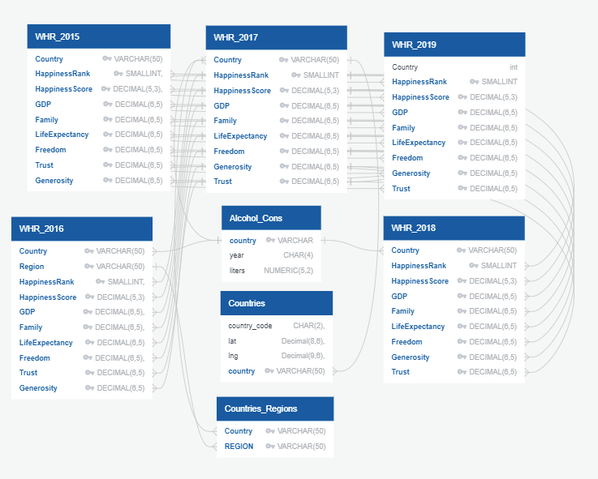

 

# Happy Places

## Project Goal
We are the country that created the happiest place on Earth, but how happy are we as a nation?
Through machine learning, we’d like to explore how each of the factors impact the overall learning process. Also, how would each ML methodological approach take different effects on overall learning scheme. In doing so, we’d may find what US needs to improve overall happiness rank. This may be particularly interesting to those who are seeking public office during future elections. 

 In search of becoming one of the happiest countries in the world, we are exploring the following key factors:

- GDP per capita
- Healthy Life Expectancy
- Social support
- Freedom to make life choices
- Generosity
- Corruption Perception
- Residual error

## Questions We Want to Answer
We want to explore the following questions:
- Which individual factors are most highly correlated to happiness?
- Is it possible to predict which countries will experience the greatest happiness based on the factors in the dataset?
- How can US improve overall happiness?
- How does CCI (Consumer Confidence Index) and CPI (Consumer Price Index) play a part in predicting overall happiness?
- Does legalization of cannibis impact happiness?

## Source Data
- https://data.oecd.org/leadind/consumer-confidence-index-cci.htm
- https://www.bls.gov/cpi/
- https://www.kaggle.com/mathurinache/world-happiness-report
- https://www.who.int/data/gho/data/indicators/indicator-details/GHO/alcohol-recorded-per-capita-(15-)-consumption-(in-litres-of-pure-alcohol)

## Communication Protocols

Throughout this project we will use the following for group communication
- Slack and Zoom: for messaging and meeting during class sessions
- Coda: for scheduling, polling, and progress tracking
- Discord: for screen sharing and voice calls outside of class sessions

## Team Responsibilties
Part I

Salih Mohammed - Database 
Jose Guerra - Database 
Henry Wang - Presentation 
Italia Cardenas - Unsupervised Machine Learning Model 
Tom Norris - Github, Supervised Machine Learning Model 

## First Steps

## Exploratory Data Analysis
Description of the data exploration phase of the project

## The Database

## Data Analysis and Machine Learning
Description of the analysis phase of the project

## Project Dashboard

## Conclusions 

## Resources
