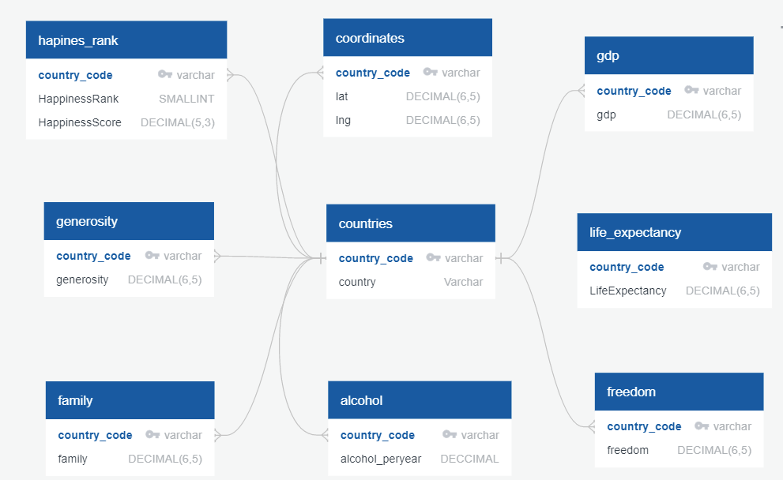

</br>

# Happy Places

## Project Goal
We are the country that created the happiest place on Earth, but how happy are we as a nation?
Through machine learning, we’d like to explore how each of the factors impact the overall learning process. Also, how would each ML methodological approach take different effects on overall learning scheme. In doing so, we’d may find what US needs to improve overall happiness rank. This may be particularly interesting to those who are seeking public office during future elections. 


 In search of becoming one of the happiest countries in the world, we are exploring the following key factors:

- GDP per capita
- Healthy Life Expectancy
- Social support
- Freedom to make life choices
- Generosity
- Corruption Perception
- Residual error

## Questions We Want to Answer
We want to explore the following questions:
- Which individual factors are most highly correlated to happiness?
- Is it possible to predict which countries will experience the greatest happiness based on the factors in the dataset?
- How can US improve overall happiness?
- How does CCI (Consumer Confidence Index) and CPI (Consumer Price Index) play a part in predicting overall happiness?
- Does legalization of cannibis impact happiness?

## Source Data
- https://data.oecd.org/leadind/consumer-confidence-index-cci.htm
- https://www.bls.gov/cpi/
- https://www.kaggle.com/mathurinache/world-happiness-report
- https://www.who.int/data/gho/data/indicators/indicator-details/GHO/alcohol-recorded-per-capita-(15-)-consumption-(in-litres-of-pure-alcohol)

## Communication Protocols

Throughout this project we will use the following for group communication
- Slack and Zoom: for messaging and meeting during class sessions
- Coda: for scheduling, polling, and progress tracking
- Discord: for screen sharing and voice calls outside of class sessions

## Team Responsibilties
Part I

Salih Mohammed - Database</br>
Jose Guerra - Database</br>
Henry Wang - Presentation</br>
Italia Cardenas - Machine Learning Model</br>
Tom Norris - Github, Machine Learning Model</br>

Part II

Salih Mohammed - Database</br>
Jose Guerra - Database</br>
Henry Wang - Presentation</br>
Italia Cardenas - Machine Learning Model</br>
Tom Norris - Github, Machine Learning Model</br>

## First Steps

Due to prescence of the pandemic, we have decided to throw out year 2020 and the present year 2021. 
- Cleaned Wolrd Happiness Report Data from 2015 to 2019;
- Looked and removed null values;
- Cleaned CCI, CPI and alcohol databases;
- Loaded additional factor data into database; alcohol loaded in ERD as trial;

## Exploratory Data Analysis
Based on the World Happiness Report, the GDP, Family, Life expentancy and freedom seem to directly impact overall happiness of a country while trust and generosity do not. 
Money is the root of all evil, but without money, it's difficult to accomplish much. The way money impacts happiness is expressed in terms of GDP. 
Here we run into the problem of US having higher GDP than the world's happiness countries, but rank much lower on happiness score. 

## The Database


The Database was created Using `PostgresSQL` (PostgreSQL 11.11, compiled by Visual C++ build 1914, 64-bit). It consists of two tables:

-Countries
  ```
  country_code
  country (country name)
  
  ```
-whr_2019
  ```
  country
  happiness rank
  happiness score
  GDP
  family
  life expectancy
  freedom
  generosity
  trust
  lat
  lng
  
  ```
The latitude and longitude are added solely for visualization and will not be included in the early stages of the analysis. The tables in this database have been exported to a CSV file and will be used for our machine learning module. The data file was not huge or confidential therefore we opted not to use cloud resources. 

## Data Analysis and Machine Learning
Based on the World Happiness Report, the GDP, Family, Life expentancy and freedom seem to directly impact overall happiness of a country while trust and generosity do not. The money is the root of all evil, but without money, it's difficult to accomplish much. The way money impacts happiness is expressed in terms of GDP. Here we run into the problem of US having higher GDP than the world's happiness countries, but rank much lower on happiness score. 
During the ML process, the Linear Regression model shows alcohol consumption may impact happiness only to certain level. 


Between 10 to 20 liters per year seems to have most clustering with happiness on the Y axis. We will continue to explore other combinations and discover more underlying trends. 
## Project Dashboard
See Google Slide
https://docs.google.com/presentation/d/1KHBlzdOCCLyFK2nmcLZyR1_vxCX9v-C6a4RVpKL31c0/edit?usp=sharing

## Conclusions 
TBD
## Resources
TBD
